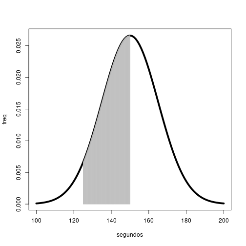
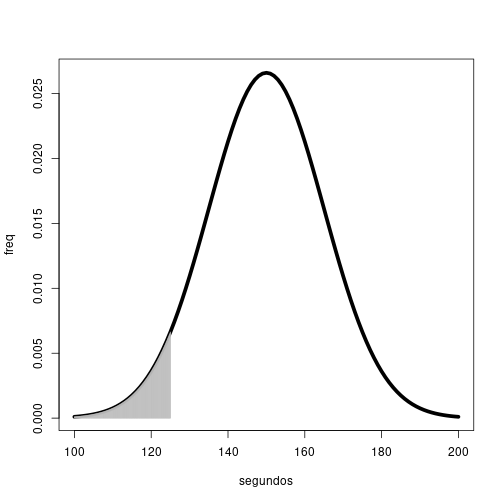
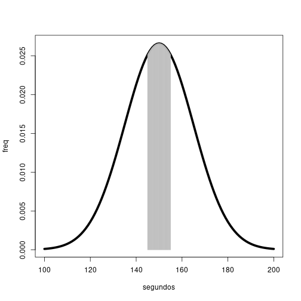
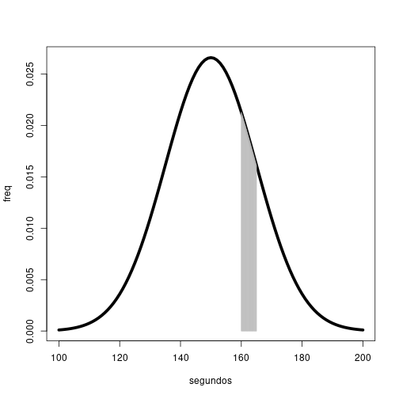
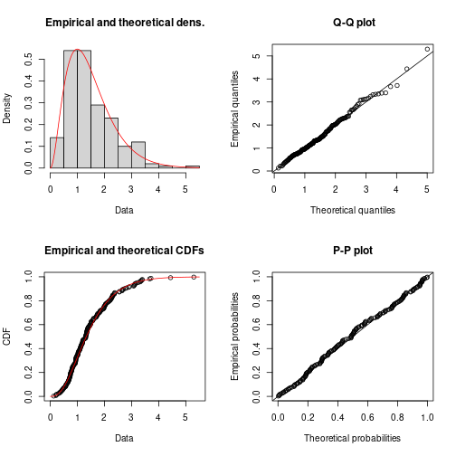
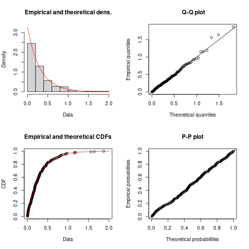
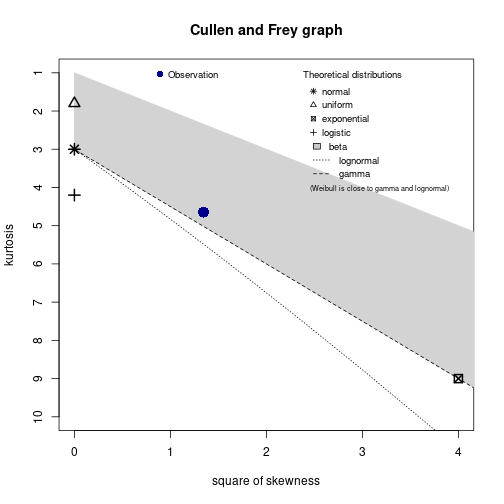
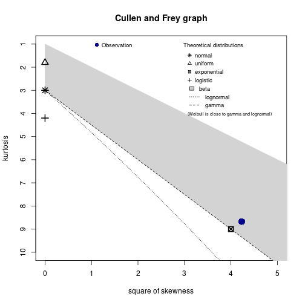

## Aluno: Marcelo Melo de Oliveira 
Link do Repositório no Github: https://github.com/marcelomeloo/P1-GED13/tree/master


## Questão 1

### a)
### - Inicializacao

```r
  library(nortest)
  amostra <- c(149.3355, 140.3779, 145.7254, 149.8931, 139.6168, 149.1934,  
  129.6147, 134.7523, 167.8030, 171.7407, 157.5422, 160.2664, 155.4553,  
  142.5989, 134.9844, 148.5172, 163.1447, 131.0138, 130.2423, 167.2239,  
  149.4015, 145.6802, 160.3472, 121.1775, 136.7295, 162.2381, 150.7192,  
  117.8144, 137.3630, 158.6373, 168.0833, 133.9263, 150.9102, 149.4811,  
  167.4367, 178.0970, 138.4903, 148.6764, 181.0990, 167.3345, 147.0679,  
  156.1410, 148.8734, 140.9484, 147.6408, 134.5726, 184.6812, 134.6648,  
  146.8130, 167.4161)

  z.amostra <- scale(amostra)
```
### - Testes

```r
  ks.test(z.amostra, "pnorm", 0, 1) #p-value = 0.4688
```

```
## 
## 	Exact one-sample Kolmogorov-Smirnov test
## 
## data:  z.amostra
## D = 0.1167, p-value = 0.4688
## alternative hypothesis: two-sided
```

```r
  shapiro.test(amostra) #p-value = 0.6324
```

```
## 
## 	Shapiro-Wilk normality test
## 
## data:  amostra
## W = 0.98185, p-value = 0.6324
```

```r
  ad.test(amostra) #p-value = 0.3928
```

```
## 
## 	Anderson-Darling normality test
## 
## data:  amostra
## A = 0.37902, p-value = 0.3928
```

```r
  lillie.test(amostra) #p-value = 0.08619 
```

```
## 
## 	Lilliefors (Kolmogorov-Smirnov) normality test
## 
## data:  amostra
## D = 0.1167, p-value = 0.08619
```

### - Interpretacao
Como em todos os testes obteve-se um valor de ```p``` maior do que 0.05, nao foi negada a hipotese nula dos testes de normalidade. Isto eh, eh possivel que a amostra siga uma distribuicao normal.

### b)

```r
  mi <- 150
  sigma <- 15

  phi <- function(x) (1/(sigma*sqrt(2*pi)))*exp((-1/2)*((x-mi)/sigma)^2)
  plot(phi, 100, 200, lwd=5, xlab="segundos", ylab="freq")
  x <- seq(125, 150, 0.1)
  lines(x, (1/(sigma*sqrt(2*pi)))*exp((-1/2)*((x-mi)/sigma)^2), type="h", col="grey")
```



Logo a probabilidade desejada deve ser:

```r
  pnorm(150,mean=mi,sd=sigma)-pnorm(125,mean=mi,sd=sigma)
```

```
## [1] 0.4522096
```

### c)

```r
  phi <- function(x) (1/(sigma*sqrt(2*pi)))*exp((-1/2)*((x-mi)/sigma)^2)
  plot(phi, 100, 200, lwd=5, xlab="segundos", ylab="freq")
  x <- seq(100, 125, 0.1)
  lines(x, (1/(sigma*sqrt(2*pi)))*exp((-1/2)*((x-mi)/sigma)^2), type="h", col="grey")
```



Logo a probabilidade desejada deve ser:

```r
  pnorm(125,mean=mi,sd=sigma)-pnorm(100,mean=mi,sd=sigma)
```

```
## [1] 0.04736129
```

### d)

```r
  phi <- function(x) (1/(sigma*sqrt(2*pi)))*exp((-1/2)*((x-mi)/sigma)^2)
  plot(phi, 100, 200, lwd=5, xlab="segundos", ylab="freq")
  x <- seq(145, 155, 0.1)
  lines(x, (1/(sigma*sqrt(2*pi)))*exp((-1/2)*((x-mi)/sigma)^2), type="h", col="grey")
```



Logo a probabilidade desejada deve ser:

```r
  pnorm(155,mean=mi,sd=sigma)-pnorm(145,mean=mi,sd=sigma)
```

```
## [1] 0.2611173
```

### e)

```r
  phi <- function(x) (1/(sigma*sqrt(2*pi)))*exp((-1/2)*((x-mi)/sigma)^2)
  plot(phi, 100, 200, lwd=5, xlab="segundos", ylab="freq")
  x <- seq(160, 165, 0.1)
  lines(x, (1/(sigma*sqrt(2*pi)))*exp((-1/2)*((x-mi)/sigma)^2), type="h", col="grey")
```



Logo a probabilidade desejada sera:

```r
  pnorm(165,mean=mi,sd=sigma)-pnorm(160,mean=mi,sd=sigma)
```

```
## [1] 0.09383728
```

## Questão 2
### a) Inicializacao

```r
  library(fitdistrplus)
```

```
## Loading required package: MASS
```

```
## Loading required package: survival
```

```r
  library(logspline)

  dados_1 <- c(1.5041523,0.5808705,0.6199756,0.2929858,1.2147418,1.1732594,1.8467931,0.7269610,1.3092812,1.9265448,1.7282812,0.2361632,1.3106581,1.8019292,0.7897818,0.5677988,0.7992817,1.3368005,1.2402656,1.0252386,0.7782393,1.8047716,1.3223821,1.5032899,0.5043259,0.7875174,1.3770674,2.0943592,0.6022997,0.9593989,1.7036922,2.6670048,2.6438775,0.7397409,0.7936696,1.7057606,1.0584502,1.3058469,0.7387255,0.8124776,0.9361091,3.1731695,1.3352055,1.4133855,5.2968719,1.9832667,0.7440084,0.4248801,0.9498297,1.3469362,2.8214065,0.6614477,1.0883973,0.7282942,0.9769054,1.8420575,2.3072208,2.2274732,1.9796718,0.3295184,0.9405720,0.9310785,1.0965863,2.5541585,1.0535822,2.3664379,0.7059021,0.8207271,2.6552079,1.3429702,1.0279349,3.3498766,0.4311925,2.0247835,3.2485039,0.6969921,0.8531717,0.7425681,1.1210406,0.6980474,0.9164595,0.8826692,3.7151028,0.6687568,2.2966736,1.3194069,1.1948272,1.3778784,0.9762028,0.3688774,3.1177911,1.6918782,2.1557233,0.9459414,1.6573522,3.1006086,2.0334823,1.3492192,0.9225732,0.8672477,0.9157428,2.1645084,2.8926458,0.8489437,1.0108665,2.3796070,0.6586505,2.2196382,1.0228407,0.6982244,0.2132779,1.0109585,0.4677821,1.5989773,0.4041169,0.8082916,1.1985266,1.4867111,1.5770678,0.4698882,2.3465176,1.0161216,2.2714103,1.4503062,1.1971287,3.6659271,0.7124729,0.9414630,0.9433260,1.4497606,0.8226787,2.0708662,1.1240895,2.0393229,1.1357822,1.3059311,3.3954544,0.6300943,2.7067416,2.1206116,3.3834169,2.3014790,3.0782228,1.2724096,0.1266975,1.5155155,1.3468412,1.7523991,1.1112829,0.7608809,1.4909929,1.4627506,0.7571807,0.3657977,1.5669474,0.4907667,1.3900836,2.2495471,0.2139862,0.9391391,1.9603337,3.3148988,0.6518895,2.5466493,0.5710819,1.5015009,2.0098511,1.1778841,1.1479635,1.8418899,0.5773628,4.4375189,1.3650535,1.1870664,1.8875720,0.7358844,1.1905181,1.0852035,1.1469524,1.4091236,1.1054257,1.9829842,1.0390362,0.5345018,1.5944451,1.5816388,3.0905316,1.9896006,1.7446187,2.2667180,3.3329492,1.3043072,2.7600491,2.9258039,2.2056283,3.1321799,1.7399257,2.3732162,1.3734298,2.2825318)
  dados_2 <- c(0.135745877,0.027801227,0.621652353,0.095321044,1.869870340,0.014069777,0.504712899,0.270444944,0.576460138,0.005244953,0.936594569,0.130279071,0.430019019,0.035218066,0.051220665,0.124571041,0.001452129,0.156699314,0.667367992,0.148696015,0.203032559,0.461745278,0.226200658,0.207342385,1.558929738,1.158500960,1.190100572,0.073877536,0.002882042,0.285999960,0.197961280,0.002450782,0.117422417,0.823656309,0.483333328,0.256101702,0.179120440,0.285672990,0.094713525,0.004261414,0.172451624,0.368246508,0.009838463,0.018810369,0.248264716,0.012309449,0.023138785,0.271411639,0.011129531,1.154086895,1.642427894,0.278249043,0.190375739,0.090812879,0.306375732,0.250538630,0.077316298,0.067569492,0.325069291,0.174358200,0.183772838,0.880181303,0.144499032,0.096748222,0.014913878,0.182470900,0.774014199,0.558953431,0.352720011,0.242701482,0.036937211,0.139831359,0.472429492,0.550160959,0.839331649,0.315060278,0.031654863,0.039161726,0.719263982,0.573912601,0.136703177,0.961008263,0.048017040,0.185566401,0.328022965,0.119452123,0.243631968,0.219705660,0.097780005,0.066600558,0.801893259,0.118525130,0.093894267,0.171407918,0.643806344,0.407935065,0.152538030,0.828248148,0.976135633,0.171226832,0.207437576,0.017928718,0.367974024,0.382116212,0.286310664,0.505668897,0.360619205,0.165460542,0.008312899,0.252883669,0.011634083,0.044036550,0.170796889,0.045739186,0.185238254,0.398405637,0.802744804,0.158099895,0.099592021,0.504599043,0.590550999,0.127166253,0.263399287,0.356424774,0.133379485,0.306932273,0.008835144,0.082912672,0.299665398,0.395902839,0.288065352,0.416609368,0.425272599,0.081970793,0.364722787,0.470545174,0.365572170,0.254081884,0.040392956,0.006842856,0.219337219,0.709242548,0.090783459,0.136946995,0.241943526,0.150708772,0.232528072,0.178806500,0.780281055,0.058001616,0.663619368,0.027661134,0.305272966,0.108765794,0.020940101,0.180222932,0.399359775,0.052619596,0.271973094,0.083619983,0.230549254,0.374328547,0.195312768,0.325166674,0.177682987,0.459848603,0.062554212,0.116410517,0.927643021,0.089508583,0.029201016,0.450543533,0.117983311,0.605630701,0.168612252,0.218150004,0.024357025,0.121119796,0.013646747,0.102652334,0.294725991,0.046641126,0.190074488,0.458263101,0.572174949,0.284940300,0.758176183,0.114249664,0.320503851,0.388042935,0.256721099,0.139473681,0.459000828,0.074468144,0.300181977,0.476743803,0.192778245,0.724294947,0.489985630,0.018394502)
```

### b)
Utilizando o comando descdist e mostre as estatísticas geradas.

```r
  descdist(dados_1, discrete = FALSE, graph = FALSE)
```

```
## summary statistics
## ------
## min:  0.1266975   max:  5.296872 
## median:  1.307606 
## mean:  1.48898 
## estimated sd:  0.8704146 
## estimated skewness:  1.159633 
## estimated kurtosis:  4.644712
```

```r
  descdist(dados_2, discrete = FALSE, graph = FALSE)
```

```
## summary statistics
## ------
## min:  0.001452129   max:  1.86987 
## median:  0.20739 
## mean:  0.3038428 
## estimated sd:  0.3081601 
## estimated skewness:  2.057199 
## estimated kurtosis:  8.673908
```

### c)
Utilizando o comando fitdist para o primeiro conjunto de dados, temos:

```r
  fit.weibull_1 <- fitdist(dados_1, "weibull")
  fit.gamma_1 <- fitdist(dados_1, "gamma")
  fit.lognormal_1 <- fitdist(dados_1, "lnorm")
  fit.normal_1 <- fitdist(dados_1, "norm")
  fit.expo_1 <- fitdist(dados_1, "exp")
  fit.gamma_1
```

```
## Fitting of the distribution ' gamma ' by maximum likelihood 
## Parameters:
##       estimate Std. Error
## shape 3.027141  0.2875985
## rate  2.032940  0.2100724
```

```r
  plot(fit.gamma_1)
```


Eh provavel que o primeiro conjunto de dados seja melhor descrito pela distribuicao gama, uma vez que eh a distribuicao que apresenta menor erro relativo para o ajuste e possui melhor alinhamento as retas dos graficos
\newline
\newline
Agora, utilizando o comando fitdist para o segundo conjunto de dados, temos:

```r
  fit.weibull_2 <- fitdist(dados_2, "weibull")
  fit.gamma_2 <- fitdist(dados_2, "gamma")
  fit.lognormal_2 <- fitdist(dados_2, "lnorm")
  fit.normal_2 <- fitdist(dados_2, "norm")
  fit.expo_2 <- fitdist(dados_2, "exp")
  fit.expo_2
```

```
## Fitting of the distribution ' exp ' by maximum likelihood 
## Parameters:
##      estimate Std. Error
## rate 3.291175  0.2327212
```

```r
  plot(fit.expo_2)
```


Eh provavel que o segundo conjunto de dados seja melhor descrito pela distribuicao exponencial, uma vez que eh a distribuicao possui melhor alinhamento as retas dos graficos
\newline
\newline
**d)**
\newline
Para os dados 1:

```r
  descdist(dados_1, discrete = FALSE)
```


De acordo com grafico, eh possivel perceber que a amostra de dados se aproxima mais de uma distribuicao gama, ja que o ponto azul se aproxima mais da reta tracejada.
Agora, para os dados 2:

```r
  descdist(dados_2, discrete = FALSE)
```


De acordo com grafico, eh possivel perceber que a amostra de dados se aproxima mais de uma distribuicao exponencial, ja que o ponto azul se aproxima mais do ponto marcado como exponencial.
\newline
\newline
**e)**
\newline
Para os dados 1:

```r
  fit.weibull_1$aic
```

```
## [1] 469.4881
```

```r
  fit.gamma_1$aic
```

```
## [1] 461.497
```

```r
  fit.lognormal_1$aic
```

```
## [1] 469.2617
```

```r
  fit.normal_1$aic
```

```
## [1] 515.0587
```

```r
  fit.expo_1$aic
```

```
## [1] 561.2366
```
Como o AIC do fit da gama eh o menor, percebe-se que, de fato, o ajuste para a distruibuicao gama eh o melhor dentre os demais para o primeiro conjunto de dados.
\newline
\newline
Agora, para os dados 2:

```r
  fit.weibull_2$aic
```

```
## [1] -72.59204
```

```r
  fit.gamma_2$aic
```

```
## [1] -72.64928
```

```r
  fit.lognormal_2$aic
```

```
## [1] -33.86214
```

```r
  fit.normal_2$aic
```

```
## [1] 99.71861
```

```r
  fit.expo_2$aic
```

```
## [1] -74.49791
```
Como o AIC do fit da exponencial eh o menor, percebe-se que, de fato, o ajuste para a distruibuicao exponencial eh o melhor dentre os demais para o segundo conjunto de dados.
\newline
\newline
**f)**
\newline

```r
  ks.test(dados_1, "pgamma", 3.027141, 2.032940, exact=FALSE)
```

```
## 
## 	Asymptotic one-sample Kolmogorov-Smirnov test
## 
## data:  dados_1
## D = 0.045778, p-value = 0.796
## alternative hypothesis: two-sided
```

```r
  ks.test(dados_2, "pexp", 3.291175, exact=FALSE)
```

```
## 
## 	Asymptotic one-sample Kolmogorov-Smirnov test
## 
## data:  dados_2
## D = 0.033408, p-value = 0.9789
## alternative hypothesis: two-sided
```
Como os p-valores sao 0.796 e 0.9789 para, respectivamente, os testes da gamma e da exponencial, podemos concluir que os ajustes sao adequados, uma vez que os p-valores sao superiores a 5%.

## Questão 3

### a)
Pelo método dos momentos temos:  
$$ \mu_1 = \ \int_{0}^{\infty} \frac{y^2*e^\frac{-y}{\beta}}{\beta^2} \,dy \ = E[Y] \quad\therefore\quad  
\mu_1 = E[Y] = 2\beta $$
$$ \mu_1 = E[Y] = 2\beta \quad\therefore\quad \beta = \mu_1/2 $$
Agora,
$$ m_1 = \mu = \mu_1 \quad\therefore\quad \beta = \frac{\mu}{2} $$
Além disso,
$$ \mu_2 = E[Y^2] = \sigma^2 + \mu^2 =  
\ \int_{0}^{\infty} \frac{y^3*e^\frac{-y}{\beta}}{\beta^2} \,dy \ = 6\beta^2 $$
$$ \sigma^2 + 4\beta^2 = 6\beta^2 \quad\therefore\quad \sigma^2 = 2\beta^2 $$
Portanto:
$$ E[\beta] = E[\frac{<Y>}{2}] = \frac{\mu}{2} $$
$$ Var[\beta] = E[\frac{<Y>^2}{4}] - E[\frac{<Y>}{2}]^2 =  
\frac{\sigma^2/n+\mu^2}{4} - \mu^2/4 = \frac{\mu^2}{8n} $$

### b)
Pelo método da máxima verossimilhança, temos:
$$ L(\beta) = f(y_1)*f(y_2)\cdots*f(y_n) = y_1*y_2\cdots*y_n * \frac{e^\frac{-n*<Y>}{\beta}}{\beta^{2n}} $$
$$ l(\beta) = ln(L(\beta)) = ln(y_1)+ln(y_2)+\cdots+ln(y_n)-\frac{n*<Y>}{\beta}-2nln(\beta) $$
$$ \frac{dl(\beta)}{d\beta} = 0 \quad\therefore\quad \frac{n*<Y>}{\beta} = 2n \quad\therefore\quad \beta_{MV} = \frac{<Y>}{2} $$
Mas,
$$ E[Y] = \ \int_{0}^{\infty} \frac{y^2*e^\frac{-y}{\beta}}{\beta^2} \,dy \ =  
2\beta = <Y> $$
$$ E[Y^2] = Var[Y] + <Y>^2 =  
\ \int_{0}^{\infty} \frac{y^3*e^\frac{-y}{\beta}}{\beta^2} \,dy \ = 6\beta^2  
\quad\therefore\quad Var[Y] = 2\beta^2 = \frac{<Y>^2}{2} $$
Portanto, temos:
$$ E[\beta] = <Y> \quad e \quad Var[\beta] = \frac{<Y>^2}{2} $$

## Questão 4

### a)
$$ \mu_{X_1} = \frac{58+72+72+86+86+100+100+114+114+128}{10} = 93 $$
**b)**
$$ \mu_{Y_1} = \frac{80+80+90+90+100+100+110+110+120+120}{10} = 100 $$
**c)**
$$ Cov[X_1, Y_1] = E[X_1 Y_1] - \mu_{X_1}*\mu_{Y_1} = 1/10*(\sum_{n=1}^{10}x_n*y_n) - 9300 $$
$$ Cov[X_1, Y_1] = 9580 - 9300 = 280 $$
**d)**
$$ E[X_1^2] = \sum_{n=1}^{6}x_n^2*P(x_n) = 0.1*58^2+0.2*72^2+0.2*86^2+0.2*100^2+0.2*114^2+0.1*128^2 $$
$$ E[X_1^2] = 9090 $$
**e)**
$$ E[Y_1^2] = \sum_{n=1}^{5}x_n^2*P(x_n) = 0.2*80^2+0.2*90^2+0.2*100^2+0.2*110^2+0.2*120^2 $$
$$ E[Y_1^2] = 10200 $$
**f)**
$$ Var[X_1] = Cov[X_1^2] = E[X_1^2] - \mu_{X_1}^2$$
$$ Var[X_1] = 9090 - 93*93 = 441 $$
**g)**
$$ Var[Y_1] = Cov[Y_1^2] = E[Y_1^2] - \mu_{Y_1}^2$$
$$ Var[Y_1] = 10200 - 100*100 = 200 $$
**h)**
$$ \rho_{X_1,Y_1}=\frac{Cov(X_1,Y_1)}{\sigma_{X_1}*\sigma_{Y_1}} $$
$$ \rho = 0.942809042 $$
**i)**
Obteve-se que a correlacao entre X2 e Y2 eh -0.942809. Com isso, observa-se que a correlacao eh igual em modulo, mas diferentes em sinal. Tal fato indica que enquanto o valor de X1 sobe eh esperado que Y1 cresca e Y2 descresca.

## Questão 5
**a)**
$$ E[X] = \sum_{n=1}^{3}x_n*P(x_n) = -3/8 + 0 + 3/8 = 0 $$
**b)**
$$ E[Y] = \sum_{n=1}^{3}y_n*P(y_n) = -3/8 + 0 + 3/8 = 0 $$
**c)**
$$ Cov[X,Y] = E[X,Y] - E[X]E[Y] = \sum_{n=1}^{3}x_n*y_n*P_{X,Y}(x_n,y_n)$$
$$ Cov[X,Y] = 1/8 + 1/8 = 1/4 $$
**d)**
Nao sao independentes, uma vez que a covariancia nao eh nula, logo o coeficiente de correlacao nao ira a zero. 
